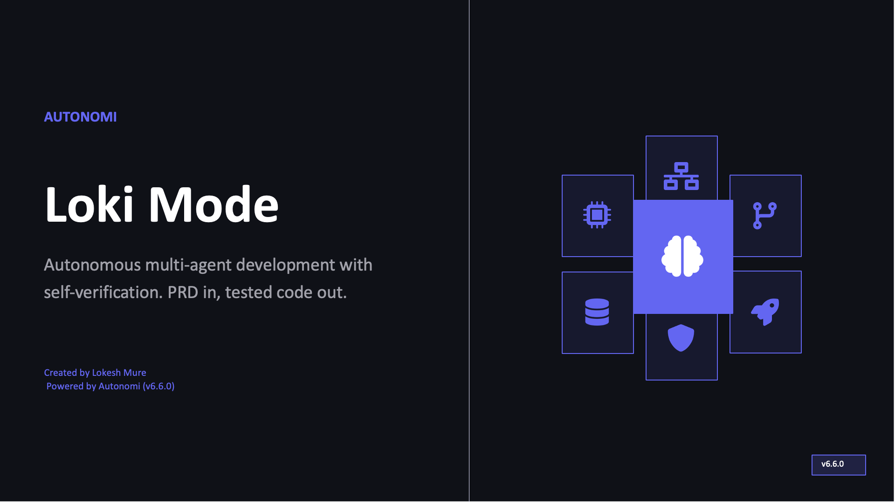

<div align="center">

# Loki Mode

### Build the future, faster.

**Describe what you want. Get production-ready code.**

[](https://www.npmjs.com/package/loki-mode)
[](https://www.npmjs.com/package/loki-mode)
[](https://github.com/asklokesh/loki-mode)
[](https://hub.docker.com/r/asklokesh/loki-mode)
[](LICENSE)

[Website](https://www.autonomi.dev/) | [Documentation](wiki/Home.md) | [Installation](docs/INSTALLATION.md) | [Changelog](CHANGELOG.md) | [Purple Lab Web UI](#purple-lab)

</div>

---

> **How it works:** You provide a PRD. Loki Mode classifies complexity, assembles an agent team from 41 specialized types across 8 swarms, and runs autonomous RARV cycles (Reason - Act - Reflect - Verify) with 9 quality gates. Code is not "done" until it passes automated verification. Output is a Git repo with source, tests, configs, and audit logs.

---

## Why Loki Mode?

- **Truly autonomous** -- Describe what you want, walk away, come back to working code with tests
- **Production quality built in** -- 9 quality gates, blind 3-reviewer code review, anti-sycophancy checks
- **Self-hosted and private** -- Your keys, your infrastructure, no data leaves your network
- **5 AI providers** -- Claude, Codex, Gemini, Cline, Aider with automatic failover
- **Full-stack output** -- Source code, tests, Docker configs, CI/CD pipelines, audit logs
- **Open source** -- Free for personal, internal, and academic use. No vendor lock-in.

---

## Get Started in 30 Seconds

```bash
npm install -g loki-mode
loki doctor                        # verify environment
loki init my-app --template simple-todo-app
cd my-app
loki start prd.md                  # autonomous build starts
```

Or skip scaffolding and go straight to a quick task:

```bash
loki quick "build a landing page with a signup form"
```

<details>
<summary><strong>Other install methods</strong></summary>

| Method | Command |
|--------|---------|
| **Homebrew** | `brew tap asklokesh/tap && brew install loki-mode` |
| **Docker** | `docker pull asklokesh/loki-mode` |
| **Inside Claude Code** | `claude --dangerously-skip-permissions` then type "Loki Mode" |
| **Git clone** | `git clone https://github.com/asklokesh/loki-mode.git` |

See the full [Installation Guide](docs/INSTALLATION.md).

</details>

---

## What You Can Build

| Project | Build Time | Complexity |
|---------|:----------:|:----------:|
| Landing page with signup form | ~10 min | Simple |
| REST API with JWT auth | ~20 min | Simple |
| Portfolio with animations | ~15 min | Simple |
| SaaS dashboard with analytics | ~25 min | Standard |
| E-commerce store with Stripe | ~45 min | Standard |
| Task manager with kanban board | ~25 min | Standard |
| Chat app with WebSocket | ~30 min | Standard |
| Blog platform with MDX | ~30 min | Standard |
| Microservice architecture | ~2 hours | Complex |
| ML pipeline with monitoring | ~3 hours | Complex |

---

## What To Expect

| | Simple | Standard | Complex |
|---|---|---|---|
| **Examples** | Landing page, todo app, single API | CRUD + auth, REST API + React | Microservices, real-time, ML pipelines |
| **Duration** | 5-30 min | 30-90 min | 2+ hours |
| **Autonomy** | Completes independently | May need guidance on complex parts | Use as accelerator with human review |

---

## Architecture

<div align="center">

</div>

<table>
<tr>
<td width="33%" valign="top">

### RARV Cycle
Every iteration: **Reason** (read state) - **Act** (execute, commit) - **Reflect** (update context) - **Verify** (run tests, check spec). Failures trigger self-correction.

[Core Workflow](references/core-workflow.md)

</td>
<td width="33%" valign="top">

### 41 Agent Types
8 swarms: engineering, operations, business, data, product, growth, review, orchestration. Auto-composed by PRD complexity.

[Agent Types](references/agent-types.md)

</td>
<td width="33%" valign="top">

### 9 Quality Gates
Blind review, anti-sycophancy, severity blocking, mock/mutation detection. Code does not ship until all gates pass.

[Quality Gates](skills/quality-gates.md)

</td>
</tr>
<tr>
<td width="33%" valign="top">

### Memory System
3-tier architecture: episodic (interaction traces), semantic (generalized patterns), procedural (learned skills). Vector search optional.

[Memory Architecture](references/memory-system.md)

</td>
<td width="33%" valign="top">

### Dashboard
Real-time monitoring, agent status, task queue, WebSocket streaming. Auto-starts at `localhost:57374`.

[Dashboard Guide](docs/dashboard-guide.md)

</td>
<td width="33%" valign="top">

### Enterprise Layer
TLS, OIDC/SSO, RBAC, OTEL tracing, policy engine, audit trails. Activated via env vars.

[Enterprise Guide](docs/enterprise/architecture.md)

</td>
</tr>
</table>

---

## Purple Lab

The hosted development platform. A Replit-like web UI for visual PRD-to-code workflow with AI chat for iterative development.

```bash
loki web                           # launches at http://localhost:57375
```

<table>
<tr>
<td width="50%" valign="top">

**Platform Pages**
- Home -- One-line prompt to start building instantly
- Projects -- Browse, search, filter past builds
- Templates -- 20+ starter PRDs by category
- Showcase -- Gallery of example projects to build
- Compare -- Feature comparison vs competitors

</td>
<td width="50%" valign="top">

**IDE Workspace**
- Monaco editor with tabs, Cmd+P quick open
- AI chat panel for iterative development
- Activity panel: build log, agents, quality gates
- Live preview with URL bar navigation
- Right-click context menu: Review, Test, Explain

</td>
</tr>
</table>

---

## Loki Mode vs. Alternatives

| Feature | Loki Mode | bolt.new | Replit | Lovable |
|---------|:---------:|:--------:|:------:|:-------:|
| Self-hosted / your keys | Yes | No | No | No |
| 5 AI provider failover | Yes | No | No | No |
| 9 quality gates | Yes | No | No | No |
| Blind code review | Yes | No | No | No |
| Enterprise auth (SSO/RBAC) | Yes | No | Yes | No |
| Air-gapped deployment | Yes | No | No | No |
| Docker + CI/CD generation | Yes | No | Yes | No |
| Open source | Yes | No | No | No |
| Free tier | Open source | Yes | Yes | Yes |

Loki Mode is the only platform that is fully self-hosted, open source, and includes automated quality verification. Your code, your keys, your infrastructure.

---

## Multi-Provider Support

| Provider | Autonomous Flag | Parallel Agents | Install |
|----------|:-:|:-:|---------|
| **Claude Code** | `--dangerously-skip-permissions` | Yes (10+) | `npm i -g @anthropic-ai/claude-code` |
| **Codex CLI** | `--full-auto` | Sequential | `npm i -g @openai/codex` |
| **Gemini CLI** | `--approval-mode=yolo` | Sequential | `npm i -g @google/gemini-cli` |
| **Cline CLI** | `--auto-approve` | Sequential | `npm i -g @anthropic-ai/cline` |
| **Aider** | `--yes-always` | Sequential | `pip install aider-chat` |

Claude gets full features (subagents, parallelization, MCP, Task tool). Other providers run sequentially. Auto-failover switches providers when rate-limited. See [Provider Guide](skills/providers.md).

---

## CLI Reference

<details>
<summary><strong>All commands</strong></summary>

| Command | Description |
|---------|-------------|
| `loki start [PRD]` | Start with optional PRD file |
| `loki stop` | Stop execution |
| `loki pause` / `resume` | Pause/resume after current session |
| `loki status` | Show current status |
| `loki dashboard` | Open web dashboard |
| `loki web` | Launch Purple Lab web UI |
| `loki doctor` | Check environment and dependencies |
| `loki plan [PRD]` | Pre-execution analysis: complexity, cost, iterations |
| `loki review [--staged\|--diff]` | AI-powered code review with severity filtering |
| `loki test [--file\|--dir\|--changed]` | AI test generation (8 languages, 9 frameworks) |
| `loki onboard [path]` | Project analysis and CLAUDE.md generation |
| `loki import` | Import GitHub issues as tasks |
| `loki ci` | CI/CD quality gate integration |
| `loki failover` | Cross-provider auto-failover management |
| `loki memory <cmd>` | Memory system: index, timeline, search, consolidate |
| `loki enterprise` | Enterprise feature management |
| `loki version` | Show version |

</details>

Run `loki --help` for all options. Full reference: [CLI Reference](wiki/CLI-Reference.md) | Config: [config.example.yaml](autonomy/config.example.yaml)

---

<details>
<summary><strong>BMAD Method Integration</strong></summary>

Loki Mode integrates with the [BMAD Method](https://github.com/bmad-code-org/BMAD-METHOD), a structured AI-driven agile methodology. If your project uses BMAD for requirements elicitation, Loki Mode can consume those artifacts directly:

```bash
loki start --bmad-project ./my-project
```

The adapter handles BMAD's frontmatter conventions, FR-format functional requirements, Given/When/Then acceptance criteria, and artifact chain validation. Non-BMAD projects are unaffected -- the integration is opt-in via `--bmad-project`.

See [BMAD Integration Validation](docs/architecture/bmad-integration-validation.md).

</details>

<details>
<summary><strong>Enterprise Features</strong></summary>

Enterprise features are included but require env var activation. Self-audit: 35/45 capabilities working, 0 broken, 1,314 tests passing.

```bash
export LOKI_TLS_ENABLED=true
export LOKI_OIDC_PROVIDER=google
export LOKI_AUDIT_ENABLED=true
loki enterprise status
```

[Enterprise Architecture](docs/enterprise/architecture.md) | [Security](docs/enterprise/security.md) | [Authentication](docs/authentication.md) | [Authorization](docs/authorization.md) | [Metrics](docs/metrics.md) | [Audit Logging](docs/audit-logging.md)

</details>

<details>
<summary><strong>Benchmarks</strong></summary>

Self-reported results from the included test harness. Verification scripts included for reproduction.

| Benchmark | Result | Notes |
|-----------|--------|-------|
| HumanEval | 162/164 (98.78%) | Max 3 retries, RARV self-verification |
| SWE-bench | 299/300 patches | Patch generation -- evaluator not yet run |

See [benchmarks/](benchmarks/) for methodology.

</details>

<details>
<summary><strong>Presentation</strong></summary>



*9 slides: Problem, Solution, 41 Agents, RARV Cycle, Benchmarks, Multi-Provider, Full Lifecycle*

**[Download PPTX](docs/loki-mode-presentation.pptx)**

</details>

---

## Limitations

| Area | What Works | What Doesn't (Yet) |
|------|-----------|---------------------|
| **Code Gen** | Full-stack apps from PRDs | Complex domain logic may need human review |
| **Deploy** | Generates configs, Dockerfiles, CI/CD | Does not deploy -- human runs deploy commands |
| **Testing** | 9 automated quality gates | Test quality depends on AI assertions |
| **Providers** | 5 providers with auto-failover | Non-Claude providers lack parallel agents |
| **Dashboard** | Real-time single-machine monitoring | No multi-node clustering |

> **What "autonomous" means:** The system runs RARV cycles without prompting. It does NOT access your cloud accounts, payment systems, or external services unless you provide credentials. Human oversight is expected for deployment, API keys, and critical decisions.

---

## Research Foundation

<details>
<summary><strong>Papers and sources</strong></summary>

| Source | What We Use |
|--------|-------------|
| [Anthropic: Building Effective Agents](https://www.anthropic.com/research/building-effective-agents) | Evaluator-optimizer, parallelization |
| [Anthropic: Constitutional AI](https://www.anthropic.com/research/constitutional-ai-harmlessness-from-ai-feedback) | Self-critique against quality principles |
| [DeepMind: Scalable Oversight via Debate](https://deepmind.google/research/publications/34920/) | Debate-based verification in council review |
| [DeepMind: SIMA 2](https://deepmind.google/blog/sima-2-an-agent-that-plays-reasons-and-learns-with-you-in-virtual-3d-worlds/) | Self-improvement loop design |
| [OpenAI: Agents SDK](https://openai.github.io/openai-agents-python/) | Guardrails, tripwires, tracing |
| [NVIDIA ToolOrchestra](https://github.com/NVlabs/ToolOrchestra) | Efficiency metrics, reward signals |
| [CONSENSAGENT (ACL 2025)](https://aclanthology.org/2025.findings-acl.1141/) | Anti-sycophancy in blind review |
| [GoalAct](https://arxiv.org/abs/2504.16563) | Hierarchical planning for complex PRDs |

**Practitioner insights:** Boris Cherny, Simon Willison, [HN Community](https://news.ycombinator.com/item?id=44623207)

**[Full Acknowledgements](docs/ACKNOWLEDGEMENTS.md)** -- 50+ papers and resources

</details>

---

## Contributing

```bash
git clone https://github.com/asklokesh/loki-mode.git && cd loki-mode
npm install && npm test              # 683 tests
python3 -m pytest                    # 631 tests
```

See [CONTRIBUTING.md](CONTRIBUTING.md) for guidelines.

## License

[Business Source License 1.1](LICENSE) -- Free for personal, internal, academic, and non-commercial use. Converts to Apache 2.0 on March 19, 2030. Contact founder@autonomi.dev for commercial licensing.

---

<div align="center">

**[Autonomi](https://www.autonomi.dev/)** | **[Documentation](wiki/Home.md)** | **[Changelog](CHANGELOG.md)** | **[Comparisons](references/competitive-analysis.md)**

</div>
